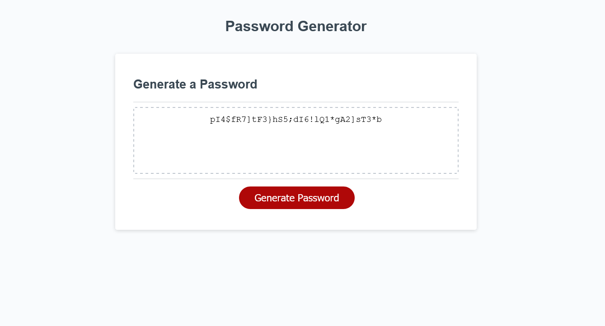

# Third Coding Bootcamp Challenge: Password Generator

##

## Description

Welcome to my third Coding Bootcamp Challenge!! This week I created a Random Password Generator using JavaScript. I completed this weeks challenge as practice to become better familiar with JavaScript. I've watched many videos from the Coding Train's Youtube channel but I've not coded much using the language. So completing this challenge has helped me get to know JavaScript a little better. I completed this challenge while referencing previous modules from the bootcamp, looking at past challenges, watching youtube videos, and using Google... A LOT OF GOOGLE.

My motivation to complete this challenge remains to be my desire to one day work in this field. I love programming. Listening to coding lectures is like listening to music. Sitting down and programming is like playing games. It feels so right!

I built this project as a means to become better. I seek to better myself as a developer and these challenges are part of my plan to go pro with coding.

This project helps me to learn how to self teach, a critical skill for any developer. By being given a set of guidelines to achieve I can then go out into the world I find solutions or stepping stones toward a solution.

This project stands out as my first real application using JavaScript. It took a lot of research to form the logic that went into this application.

## Installation

N/A

## Usage

You can use this application simply by loading the page, answering a few prompts, and clicking generate password!

## Credits

A HUGE shout out to Traversy Media for their youtube video on [Creating Random Passwords.](https://www.youtube.com/watch?v=duNmhKgtcsI)

Also, thank you to my Bootcamp for providing me with a list of [Special Characters.](https://owasp.org/www-community/password-special-characters)

## License

You can view the license I chose [here](https://choosealicense.com/licenses/mit/)

## Badges

